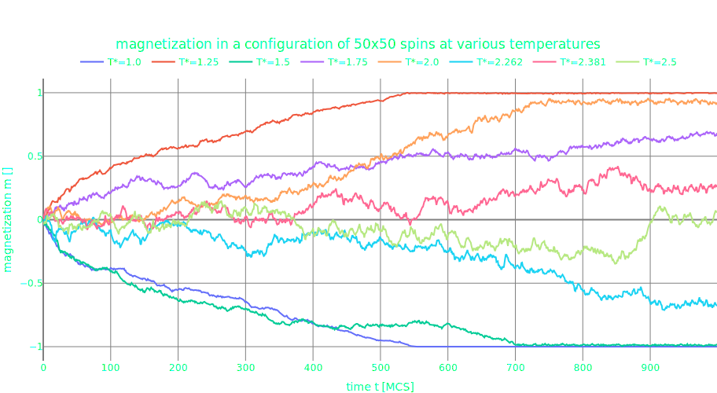

<h1 align="center"><strong>Monte Carlo simulations of Ising Model</strong></h>

 
 

## ABOUT

The program provide the Monte Carlo simulations of 2D Ising model.

## COMMAND LINE INTERFACE

    py main.py [-a|--algorithm <string>] [-h|--external-magnetic-field <float>] [--help] [-J|--J|--interaction <float>] [-K|--K|--steps <int>] [-L|--length <int>] [-m0|--initial-magnetization <float>] [-s|--seed <int>] [-sc|--save-configuration [<path>]] [-sm|--save-magnetization [<path>]] [-T*|--temperature-reduced <float>] [-v|--visualization [<char><char>]]

## MANUAL

  <code>-a &lt;string&gt;</code> 
  <code>--algorithm &lt;string&gt;</code> 
  <ul>
    An algorithm used by Monte Carlo method to computing the evolution of system.  Avaliable algorithms: "metropolis"; "glauber".  
    The default is "glauber".
  </ul>

 

  <code>-h &lt;float&gt;</code> 
  <code>--external-magnetic-field &lt;float&gt;</code> 
  <ul>
    External homogenious magnetic field h in the system. 
    The default is 0.0.
  </ul>

 

  <code>--help</code> 
  <ul>
    Prints that text, without executing the code.
  </ul>

 

  <code>-J &lt;float&gt;</code> 
  <code>--J &lt;float&gt;</code> 
  <code>--interaction &lt;float&gt;</code> 
  <ul>
    Interaction parameter J between each pair of spins. 
    The default is 1.0.
  </ul>

 

  <code>-K &lt;int&gt;</code> 
  <code>--K &lt;int&gt;</code> 
  <code>--steps &lt;int&gt;</code> 
  <ul>
    Time limit. Number of MCSs (iterations). 
    The default is 400.
  </ul>

 

  <code>-L &lt;int&gt;</code> 
  <code>--length &lt;int&gt;</code> 
  <ul>
    Length L of lattice LxL in the system of spins. 
    The default is 40.
  </ul>

 

  <code>-m0 &lt;float&gt;</code> 
  <code>--initial-magnetization &lt;float&gt;</code> 
  <ul>
    Initial magnetization m(t=0) in the system. 
    The default is 0.0.
  </ul>

 

  <code>-s &lt;int&gt;</code> 
  <code>--seed &lt;int&gt;</code> 
  <ul>
    A seed for random number generator in module "random" from the standard library. 
    The default is 1997.
  </ul>

 

  <code>-sc [&lt;path&gt;]</code> 
  <code>--save-configuration [&lt;path&gt;]</code> 
  <ul>
    At the end of the simulation the configuration of spins S[ij] will be saved in given directory. 
    The dafault is ".\".
  </ul>

 

  <code>-sm [&lt;path&gt;]</code> 
  <code>--save-magnetization [&lt;path&gt;]</code> 
  <ul>
    At the end of a simulation, time-dependent evolution of magnetization m in the system will be saved in given directory. 
    The dafault is ".\".
  </ul>

 

  <code>-T* &lt;float&gt;</code> 
  <code>--temperature-reduced &lt;float&gt;</code> 
  <ul>
    Reduced temperature T* in the system. T*==1/(J x Beta). 
    The default is 1.0.
  </ul>

 

  <code>-v [&lt;char&gt;&lt;char&gt;]</code> 
  <code>--visualization [&lt;char&gt;&lt;char&gt;]</code> 
  <ul>
    Turns on the visual evolution of the system. <code>&lt;char&gt;&lt;char&gt;</code> is a pair of characters which represent spin "up" and spin "down". The total time of the execution will increase. 
    The default pair is U+0020, U+2588.
  </ul>

 
    
## REQUIREMENTS

    Python >= 3.10.2

## EXAMPLES

    py main.py -T* 2.26 -a "metropolis" -v
    py main.py -L 30 -m0 1.0 -sc
    py main.py --seed 23 -K 3000 -sm "./data/"

## DATASETS

Check examples of generated datasets in [Kaggle](https://www.kaggle.com/datasets/quantumbraindisorder/magnetization).
